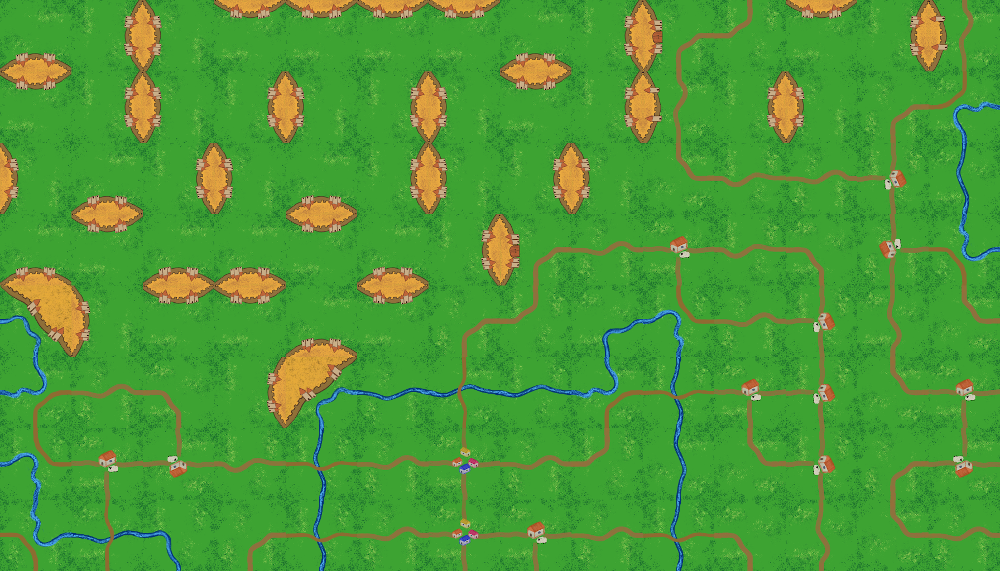

# DH2323 Final Project: Hierarchical Semantic Wave Function Collapse for Procedural Tile Map Generation 

By Natalie Eriksson and Anna Likhanova



## Running the code

```
git clone https://github.com/annaLiksomething/procedural-hswfc.git
cd procedural-hswfc
python hswfc.py
```
The output will be saved as `finalresult.png`

## Project Documentation
### Report and DevBlog
Devblog is available [here](https://wooded-prose-a7b.notion.site/13-tiles-are-born-359d86066a7480609674e8afe63e7083)

Project report is available [here](DH2323ProjectReport.pdf)


## License & Attribution

### Tile Assets
The tile assets were hand-drawn by Anna Likhanova and are stylistically inspired by the board game *Carcassonne* (© Hans im Glück). They were created solely for use in an academic research project and accompanying thesis.

**These assets are not licensed for redistribution, commercial use, or use in other projects.** They are included here for transparency and reproducibility of the research results.

### Academic Use
If you use the code from this project in your own research, please cite:
> Natalie Eriksson & Anna Likhanova. (2026). *Implementation and evaluation of Hierarchical Semantic Wave Function Collapse for Procedural Tile Map Generation*. Royal Institure of Technology, Stockholm.

## Acknowledgements

This project was inspired by Shaad Alaka's Master Thesis available to read [here](https://repository.tudelft.nl/record/uuid:e79264cc-1d0a-4151-9158-342a96d46764)

This implementation was initially based on a [WFC tutorial by Uriel Garcilazo](https://urielgarcilazo.com/tutorials/4_WaveFunctionCollapse.html)
